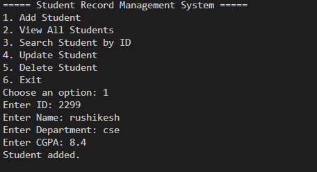
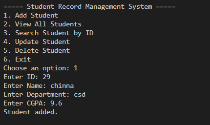
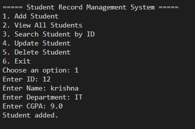
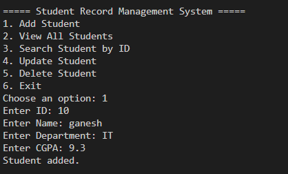
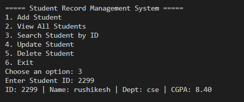
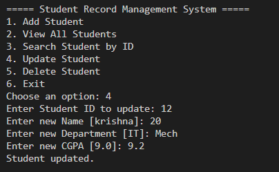
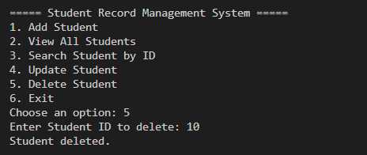
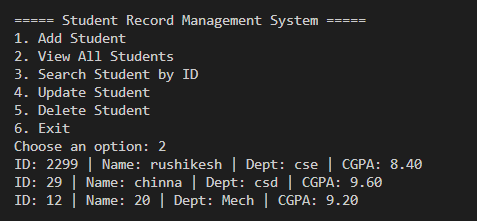

# Student Record Management System (Java)
## 📸 Screenshots

### ➕ Add Student






### 📄 Search by id Students


### 📄 Update Students


### ❌ Delete Student


### 📄 View All Students



A simple console-based CRUD application to manage student records.

## Features
- Add, view, search, update, and delete student records
- Data persistence using a text file (`students.txt`)
- Demonstrates core Java concepts: OOP, ArrayList, File I/O, Exception Handling

## How to Run
```bash
# Compile
javac StudentRecordManagementSystem.java

# Run
java StudentRecordManagementSystem
```

## Skills Demonstrated
Java · OOP · ArrayList · File Handling · Exception Handling · Console I/O

